<p align="center">
  <picture>
    <source media="(prefers-color-scheme: dark)" srcset="docs/assets/hero-dark.svg" />
    
  </picture>
</p>

<p align="center">
  <a href="https://github.com/Juanzaan/studere/actions/workflows/ci.yml"></a>
  <a href="LICENSE"></a>
</p>

# Studere

**Record the class. Leave with a study pack.**  
Studere turns audio, notes, and transcripts into summaries, flashcards, quizzes, mind maps, and a session-aware tutor — without retyping the lecture the night before the exam.

> **Source-available, not open source.** Evaluation and reading only. No commercial use, redistribution, or derivative products. See [LICENSE](LICENSE).

---

## Why

Most students already record class. Almost none re-listen. Making flashcards by hand is the work that gets skipped.

Studere is opinionated about that gap: **one upload → one coherent package**, quality-checked before it hits the dashboard. Weak summaries get a second pass. Chat answers stay scoped to *your* session. Long recordings (2h+) are chunked, not rejected.

If you want a generic chatbot with a file upload, this is the wrong repo. If you want the class to become something you can *study*, keep reading.

---

## What you get

| You bring | You leave with |
|-----------|----------------|
| Audio / video (including 2h+) | Clean transcript |
| Pasted notes or transcript | Structured summary |
| Photo of an exercise | Graded attempt (vision) |
| Follow-up questions | **Stude** — tutor with session context |

Plus spaced-repetition flashcards, MCQ quizzes with explanations, and a mind map of the concepts — generated as a single study session, private per user (Clerk).

---

## How it works

1. **Capture** — mic, file, or text.
2. **Transcribe** — Whisper for small files; chunked upload → FFmpeg → parallel Whisper for large ones.
3. **Generate** — summary, cards, quiz, map; score weak sections and enrich before cache.
4. **Study** — dashboard, session detail, Stude chat, exports (Markdown / CSV).

Auth is Clerk (email + social). The frontend is local-first for sessions; AI runs on Azure Functions + Azure OpenAI.

---

## Stack

**Frontend:** Next.js 14 (App Router), TypeScript, Tailwind, GSAP, Clerk. Recharts for the
dashboard, ECharts for the mind map, KaTeX for formulas.  
**Backend:** Azure Functions (Node), FFmpeg, Blob Storage, GPT-4o-mini / GPT-4.1-mini / Whisper.

Node 20 or newer — Vitest 4 reads `node:util`'s `styleText`, which Node 18 does not have.

---

## Getting started

```bash
git clone https://github.com/Juanzaan/studere.git
cd studere

# Frontend
cd frontend && npm install
cp .env.local.example .env.local   # Clerk keys + backend URL
npm run dev                        # http://localhost:3000

# Backend (separate terminal)
cd ../backend && npm install
cp local.settings.example.json local.settings.json   # Azure OpenAI + Clerk secret
npm start
```

Unauthenticated `/` serves the marketing landing. Signed-in users land on `/dashboard`.

Leave `CLERK_SECRET_KEY` empty in the backend settings and it runs with auth disabled, which
is enough to develop the frontend against it. Set it and every protected Function starts
requiring a valid bearer token.

More detail: [CONTRIBUTING.md](CONTRIBUTING.md) · [CODING_STANDARDS.md](CODING_STANDARDS.md) · [CHANGELOG.md](CHANGELOG.md)

---

<details>
<summary><strong>Backend endpoints</strong></summary>

| Function | Purpose |
|----------|---------|
| `GenerateStudySession` | Study package + quality enforcement |
| `TranscribeAudio` | Whisper proxy for small files |
| `ProcessAudio` | Server-side FFmpeg + batch transcription |
| `UploadAudioChunk` | Chunked upload → Azure Blob |
| `StudeChat` | Tutor with session context + identity-scoped cache |
| `EvaluateExercise` | Exercise grading (vision) |
| `HealthCheck` | Health + cache stats |

Protected routes expect `Authorization: Bearer <Clerk session JWT>` when `CLERK_SECRET_KEY` is set.

</details>

<details>
<summary><strong>Project structure</strong></summary>

```
studere/
├── frontend/                 # Next.js 14
│   ├── app/                  # App Router (landing rewrite, dashboard, Clerk)
│   ├── components/           # UI, session panels, landing
│   ├── lib/                  # API client, storage, audio, types
│   ├── src/tests/            # Vitest unit suites
│   └── e2e/                  # Playwright specs + Clerk auth setup
└── backend/                 # Azure Functions
    ├── GenerateStudySession/
    ├── TranscribeAudio/
    ├── ProcessAudio/
    ├── UploadAudioChunk/
    ├── StudeChat/
    ├── EvaluateExercise/
    ├── HealthCheck/
    └── shared/              # OpenAI client, cache, pipeline, auth
```

</details>

---

## Testing

```bash
cd frontend
npm run typecheck   # tsc --noEmit, strict
npm test            # Vitest
npm run test:e2e    # Playwright (starts its own dev server)
```

CI ([`ci.yml`](.github/workflows/ci.yml)) runs typecheck, Vitest and a production build on Node
20, then the Playwright suite on Chromium. The E2E job signs in through Clerk's testing helpers
and reuses one saved session, so specs never drive the sign-in form. CodeQL runs as its own
workflow.

Playwright targets `127.0.0.1`, not `localhost`. On a dual-stack host `localhost` resolves to
`::1` first, and over IPv6 the Next dev server sends response headers but never flushes the
body — every dynamic route hangs while the server log cheerfully reports `200`.

---

## Deploy

| Layer | Target |
|-------|--------|
| Frontend | Vercel (or any Node host for Next.js) |
| Backend | Azure Functions |
| Secrets | Clerk + Azure OpenAI + Blob in host env — never in the client bundle |

---

## Security (short)

- Session IDs validated against a strict pattern (no path traversal).
- Image answers limited to base64 data URLs (no remote fetch / SSRF).
- Chat replies are cached per user: `StudeChat` keys on the Clerk `sub`, so one account cannot
  serve another's answer. Transcription and generation caches are content-addressed instead —
  identical input hits the same entry for everybody, which is the intent, and means they hold
  no per-user data.
- Backend auth is fail-closed **once `CLERK_SECRET_KEY` is set**. Without it the Functions log a
  warning and serve unauthenticated, which is a development mode, not a deployment one.

---

## License

**Studere Proprietary License** — all rights reserved.

- You may **view and study** the code for evaluation.
- You may **not** use it commercially, run a competing service, redistribute it, or reuse it in any other project.

© 2026 [Juan Pablo Zanolli](https://github.com/Juanzaan). Contact the author for licensing.