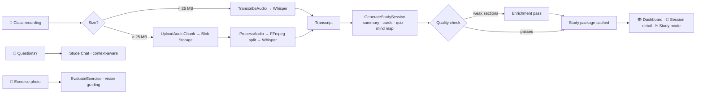
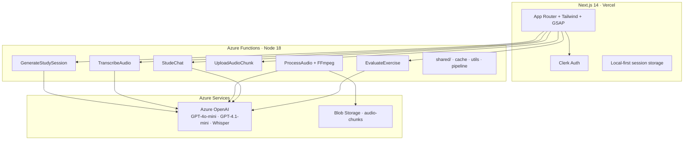

<p align="center">
  
  
  
  
  
  
  
</p>

<div align="center">
  <h1>📚 Studere</h1>
  <p><strong>Your AI study partner. Record the class, get the full study package.</strong></p>
  <p>
    <a href="https://github.com/Juanzaan/studere">📦 GitHub</a> ·
    <a href="CHANGELOG.md">📋 Changelog</a> ·
    <a href="CODING_STANDARDS.md">📐 Coding Standards</a> ·
    <a href="#-license">🔒 License</a>
  </p>
</div>

<br/>

**Studere** is a SaaS platform that turns class recordings, transcripts, and notes into complete study packages — AI summaries, flashcards, quizzes, mind maps, and exercises — in minutes. It also includes **Stude**, an AI tutor that answers follow-up questions with the session as context.

> ⚠️ **Proprietary software.** This code is source-available for evaluation only. Commercial use, redistribution, or reuse in other applications is strictly prohibited. See [LICENSE](LICENSE).

---

## 📑 Table of Contents

- [The product](#-the-product)
- [Features](#-features)
- [How it works](#-how-it-works)
- [Architecture](#-architecture)
- [Tech stack](#-tech-stack)
- [Getting started](#-getting-started)
- [Backend endpoints](#-backend-endpoints)
- [Testing](#-testing)
- [Deployment](#-deployment)
- [Security](#-security)
- [License](#-license)

---

## 🎯 The product

Studere sits in the gap between "recorded the class and never listened to it again" and "spent three hours making flashcards". Upload an audio file (even 2+ hours), paste a transcript, or drop notes — the platform returns:

| Input | Output |
|-------|--------|
| 🎤 Audio / video recording (2h+) | 📝 AI summary with structured headings |
| 📋 Pasted text or transcript | 🃏 Flashcard deck with spaced repetition |
| 📄 Class notes (.txt, .md) | ✍️ Multiple-choice quiz with explanations |
| 📸 Photo of whiteboard / exercise | 🧠 Mind map of key concepts |
| | ✅ Action items, exercises, AI grading |
| | 🤖 Stude — contextual AI tutor |

Authentication is handled by **Clerk** (email + social), so every user's study library is private and portable.

---

## ✨ Features

<div align="center">

| Category | Features |
|:---|---|
| **🎓 Study Tools** | AI summaries, spaced-repetition flashcards, quizzes, mind maps, exercises — auto-generated with quality enforcement |
| **🎙️ Audio Pipeline** | Client-side Whisper proxy for files < 25 MB; chunked upload → Azure Blob → server-side FFmpeg + Whisper for 2h+ recordings |
| **🤖 AI Tutor** | Stude Chat with session-aware context, chart/mind-map rendering, exercise evaluation with vision (handwritten answers) |
| **📊 Analytics** | Study metrics, Recharts visualizations (bar, line, pie), progress tracking per session |
| **🎨 UI/UX** | GSAP animations, dark/light mode, skeleton loading, guided tour, fully responsive |
| **♿ Accessibility** | WCAG AA contrast, semantic HTML, ARIA, keyboard navigation, screen-reader friendly |
| **📦 Export** | Markdown and CSV export of all study materials |

</div>

---

## 🔄 How it works



---

## 🏗️ Architecture



### Key design decisions

- **Dual audio pipeline** — small files transcribe directly; large ones are chunked (10 MB), uploaded, reassembled server-side, split with FFmpeg and transcribed in parallel batches of 5.
- **Quality-enforced generation** — every AI output is scored (summary depth, concept count, explanation length); weak sections are enriched with targeted follow-up calls before caching.
- **Shared OpenAI client** — a single client + deployment resolution per Function, with retry-with-backoff and timeout on every model call.
- **Cache everywhere** — transcripts, generated packages, and chat answers are SHA-256 keyed. Chat cache includes the user's identity so no response leaks between accounts.
- **Security by default** — session IDs validated against a strict pattern (path-traversal proof), image answers restricted to base64 data URLs (SSRF-proof), chunk uploads idempotent.

---

## 🛠️ Tech stack

| Layer | Technology |
|:---|---:|
| **Frontend** | Next.js 14 (App Router), TypeScript (strict), Tailwind CSS 3.4, GSAP 3.14, React Flow, Recharts, Lucide, KaTeX |
| **Auth** | Clerk (`@clerk/nextjs` v6) |
| **Backend** | Azure Functions (Node 18), Azure OpenAI (GPT-4o-mini, GPT-4.1-mini, Whisper), Azure Blob Storage, FFmpeg |
| **Testing** | Vitest (311 unit tests · 14 suites), Playwright (76 tests · 9 specs) |

---

## 🚀 Getting started

### Prerequisites

| Tool | Version | Purpose |
|:---|---:|:---|
| Node.js | ≥ 18 | Runtime |
| Azure Functions Core Tools | v4 | Local backend emulation |
| Azurite | — | Local Blob Storage emulation |
| Clerk account | — | Auth keys (frontend) |
| Azure OpenAI | GPT-4o-mini + Whisper | AI generation (backend) |

### Install

```bash
git clone https://github.com/Juanzaan/studere.git
cd studere

# Frontend
cd frontend && npm install

# Backend
cd ../backend && npm install
```

### Configure — frontend

**`frontend/.env.local`** (see `.env.local.example`):

```env
NEXT_PUBLIC_BACKEND_URL=http://localhost:7071
NEXT_PUBLIC_CLERK_PUBLISHABLE_KEY=pk_test_...
CLERK_SECRET_KEY=sk_test_...
```

> ⚠️ `.env.local` is gitignored. Never commit your Clerk keys.

### Configure — backend

**`backend/local.settings.json`** (gitignored):

```json
{
  "IsEncrypted": false,
  "Values": {
    "AzureWebJobsStorage": "UseDevelopmentStorage=true",
    "FUNCTIONS_WORKER_RUNTIME": "node",
    "AZURE_OPENAI_ENDPOINT": "https://your-resource.openai.azure.com/",
    "AZURE_OPENAI_KEY": "your-key",
    "AZURE_OPENAI_DEPLOYMENT": "gpt-4o-mini",
    "AZURE_OPENAI_WHISPER_DEPLOYMENT": "whisper",
    "AZURE_STORAGE_CONNECTION_STRING": "UseDevelopmentStorage=true",
    "ALLOWED_ORIGIN": "http://localhost:3000",
    "CLERK_SECRET_KEY": "sk_test_..."
  }
}
```

> 🔑 **Important:** rotate your `CLERK_SECRET_KEY` before any production deployment.
>
> 🔐 **Backend auth:** all AI endpoints (`generate-study-session`, `transcribe-audio`, `evaluate-exercise`, `stude-chat`, `upload-audio-chunk`, `process-audio`) verify the Clerk session token (`Authorization: Bearer <token>`) sent by the frontend. If `CLERK_SECRET_KEY` is not configured, the backend falls back to unauthenticated dev mode — set it in the Azure Function App settings for production.

### Run locally

```bash
# Terminal 1 — Storage emulator
azurite --silent --location ./azurite

# Terminal 2 — Backend
cd backend && func start

# Terminal 3 — Frontend
cd frontend && npm run dev
```

Open **http://localhost:3000** 🎉

---

## 🔌 Backend endpoints

| Function | Route | Purpose |
|:---|---:|:---|
| `GenerateStudySession` | `POST /api/generate-study-session` | Full study package from transcript (with quality enforcement) |
| `TranscribeAudio` | `POST /api/transcribe-audio` | Whisper transcription for files < 25 MB |
| `UploadAudioChunk` | `POST /api/upload-audio-chunk` | Chunked upload (10 MB chunks) → Blob Storage |
| `ProcessAudio` | `POST /api/process-audio` | Server-side FFmpeg split + parallel Whisper transcription |
| `StudeChat` | `POST /api/stude-chat` | Context-aware AI tutor with per-user caching |
| `EvaluateExercise` | `POST /api/evaluate-exercise` | Exercise grading, vision-enabled for photo answers |
| `HealthCheck` | `GET /api/health` | Health + cache stats |

---

## 🧪 Testing

```bash
cd frontend

# Unit tests (311 tests · 14 suites)
npm test

# Coverage report
npm run test:coverage

# E2E (all browsers)
npm run test:e2e

# E2E (Chromium only, faster)
npx playwright test --project=chromium
```

**Current status:** 309/311 unit tests pass; 2 timing-sensitive tests occasionally exceed their 5 s timeout and are considered known flaky. 76 E2E tests across 9 specs (critical flows, auth-aware UI, audio transcription, AI generation, flashcards, quiz, session detail, library, a11y).

---

## 📦 Deployment

### Frontend → Vercel

Set the same env vars from `.env.local` in Vercel's project settings and connect the repo. Deploys on push to `main`.

```bash
cd frontend
npx vercel --prod
```

### Backend → Azure Functions

```bash
cd backend
func azure functionapp publish your-function-app-name
```

Required **Application Settings** (Azure Portal):

```env
AZURE_OPENAI_ENDPOINT=https://your-resource.openai.azure.com/
AZURE_OPENAI_KEY=your-key
AZURE_OPENAI_DEPLOYMENT=gpt-4o-mini
AZURE_OPENAI_WHISPER_DEPLOYMENT=whisper
AZURE_STORAGE_CONNECTION_STRING=DefaultEndpointsProtocol=...
ALLOWED_ORIGIN=https://your-app.vercel.app
FFMPEG_PATH=/path/to/ffmpeg   # optional — otherwise auto-downloaded to %TEMP%
```

---

## 🔐 Security

- **No secrets in the repo** — Clerk keys live only in gitignored env files; CI and code scans enforce this.
- **Path traversal protection** — every `sessionId` is validated against `^[A-Za-z0-9_-]{1,64}$` before touching the filesystem or blob storage.
- **SSRF protection** — exercise images are restricted to base64 data URLs; remote URLs are rejected.
- **User-isolated caching** — chat cache keys include the user identity.
- **Graceful failure** — failed audio processing keeps uploaded chunks so clients can retry; uploads are idempotent (`overwrite` semantics).
- **No error leakage** — 500 responses return generic messages; details stay in structured logs.

---

## 📁 Project structure

```
studere/
├── frontend/                        # Next.js 14 app
│   ├── app/
│   │   ├── page.tsx                 # Marketing landing (auth-aware redirect)
│   │   ├── (app)/                   # Dashboard, library, starred, upcoming,
│   │   │                            # analytics, integrations, sessions/[id]
│   │   ├── sign-in/ · sign-up/      # Clerk pages
│   │   └── dev/seed/                # Development seed page
│   ├── components/                  # UI + session panels + landing page
│   ├── lib/                         # API client, storage, types, audio, utils
│   ├── src/shared/                  # Hooks (useAnimations, useFadeInStagger)
│   ├── src/tests/                   # 14 Vitest suites (311 tests)
│   ├── e2e/                         # 9 Playwright specs (76 tests)
│   └── scripts/                     # Doc-coverage script
│
└── backend/                         # Azure Functions (Node 18)
    ├── GenerateStudySession/        # Study package + quality enforcement
    ├── TranscribeAudio/             # Whisper proxy (small files)
    ├── ProcessAudio/                # Server-side FFmpeg + transcription
    ├── UploadAudioChunk/            # Chunked upload → Blob Storage
    ├── StudeChat/                   # AI tutor with session context
    ├── EvaluateExercise/            # Exercise grading (vision API)
    ├── HealthCheck/                 # Health + cache stats
    └── shared/                      # OpenAI client, cache, utils, audio pipeline
```

---

## 🔒 License

**Studere is proprietary software — all rights reserved.**

This project is released under the [Studere Proprietary License](LICENSE). In short:

- ✅ You may **view and study** the code for evaluation.
- ❌ You may **not** use it commercially, run a competing SaaS with it, redistribute it, modify it, or reuse any part of it in another application.
- ⚖️ Violations are copyright infringement and breach of contract, and may result in **legal action** (injunctions, damages, attorney's fees).

Contact the author for any licensing requests.

© 2026 [Juan Pablo Zanolli](https://github.com/Juanzaan) — All rights reserved.

<p align="center">
  <sub>Built with ❤️ for students who want to study smarter.</sub>
</p>
